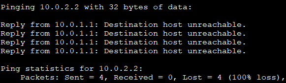
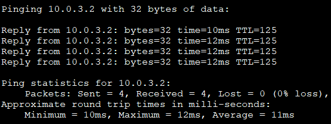
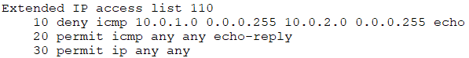
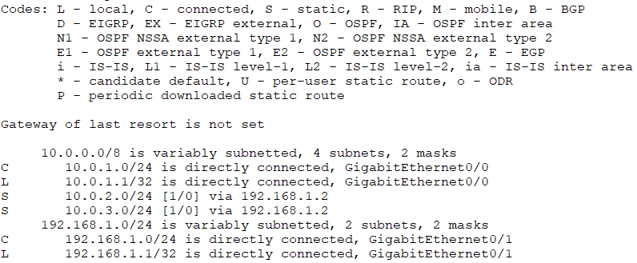

# 🌐 Network Segmentation & Access Control Validation Lab (Packet Tracer)

Date: April 2025  
Tool: Cisco Packet Tracer  
Focus: Network segmentation design, access control enforcement, and traffic path validation in a simulated multi-router environment.

This lab demonstrates real-world network segmentation enforcement using ACLs, including validation through traffic blocking, routing inspection, and ACL hit analysis.

---

## 🎥 Demo Walkthrough (2 min)

What you're seeing in this demo:

1. Topology Overview  
   → Multi-router segmented network with ACL enforcement  

2. Routing Validation  
   → Static routes controlling traffic flow between subnets  

3. Access Control Verification  
   → ACL hit counters confirm active filtering

4. Blocked Traffic  
   → ACL denies unauthorized ICMP communication  

5. Allowed Traffic  
   → Permitted segments successfully communicate  

▶️ Watch Demo:  
[segmentation-demo.mp4](./video/segmentation-demo.mp4)

Recruiter Tip: Watch this first for a quick understanding of project functionality.

---

# 🧠 Lab Objective & Scenario

This lab demonstrates the design and validation of a segmented network using multiple routers, structured subnetting, static routing, DHCP configuration, and extended access control lists.

The objective was to analyze how traffic flows across segmented networks and verify that access control policies correctly restrict or allow communication between specific network segments.

The environment was built as a controlled simulation using Cisco Packet Tracer.

---

# 🏗️ Network Architecture

The network consists of three routers connected through separate subnets.

Key components include:

- Multiple segmented networks using structured subnetting  
- Static routing between routers  
- DHCP services providing automatic IP assignment  
- Extended Access Control Lists applied to router interfaces  

Each subnet represents an isolated network segment with defined routing and access control behavior.

---

# 🔧 Key Configurations

### Static Routing

Manually configured route entries between routers to ensure packets follow intended paths.

Validated routing tables using:

show ip route

---

### DHCP Configuration

DHCP pools were configured on routers to automatically assign IP addresses to client systems.

Configuration included:

- IP address range  
- Default gateway assignment  
- Network mask definition  

Client systems successfully received IP configuration dynamically.

---

### Access Control Enforcement

Extended ACL rules were implemented to control ICMP communication between selected subnets.

ACLs were applied to router interfaces to enforce segmentation policies.

Verification included:

show access-lists

This confirmed that restricted traffic was blocked while permitted traffic was allowed.

---

# 🔎 Validation & Testing

Traffic validation was performed using:

- `ping`  
- `traceroute`  
- router CLI inspection  

Testing scenarios included verifying both permitted and restricted traffic paths between network segments.

---

# ✅ Test Results

| Test | Result | Observation |
|-----|-----|-----|
| PC1 ➜ PC2 ping | Allowed | Routing between segments operational |
| PC2 ➜ PC3 ping | Blocked | ACL policy enforced |
| PC1 ➜ PC3 ping | Allowed | Segmentation policy correctly configured |
| `show access-lists` | Hits logged | ACL filtering confirmed |
| `show ip route` | Valid | Static routes functioning |

---

# 🔐 Proof of Enforcement (Visual)

### Blocked Traffic (ACL in Action)

### Allowed Traffic

### ACL Hit Counters

### Routing Validation

---

# 📁 Repository Contents

- `segmentation-lab.pkt` — Packet Tracer topology file  
- `video/segmentation-demo.mp4` — Short demonstration of network behavior and ACL enforcement
- `/screenshots` — Topology and validation proof 
- `proof-of-function.md` — Traffic validation observations  

---

# 🚀 How to Verify (Quick)

1. Open `segmentation-lab.pkt` in Cisco Packet Tracer  
2. Run:
   - `show ip route`
   - `show access-lists`
3. Test:
   - PC2 → PC3 (should fail)
   - PC1 → PC3 (should succeed)

---

# 🧰 Skills Demonstrated

- Network segmentation fundamentals  
- Structured subnetting and IP planning  
- Static routing configuration  
- DHCP deployment and validation  
- Access control policy enforcement  
- Traffic path verification using CLI tools  

---

# 🎯 Key Takeaway

This lab demonstrates how network segmentation and access control policies can be implemented and validated in a routed environment to enforce communication boundaries between network segments.

---

# 📘 What I Learned

- How structured subnetting helps isolate network segments and control communication paths  
- How static routing determines packet paths between segmented networks  
- How extended ACL rules influence ICMP traffic flow between different subnets  
- How to verify access control behavior using `ping`, `traceroute`, and router CLI commands  
- How to validate network security policies by observing both permitted and blocked traffic paths  
- How router commands such as `show ip route` and `show access-lists` confirm routing and ACL enforcement  

---

# ⚠️ Disclaimer

This project was conducted in a simulated lab environment using Cisco Packet Tracer for educational purposes.